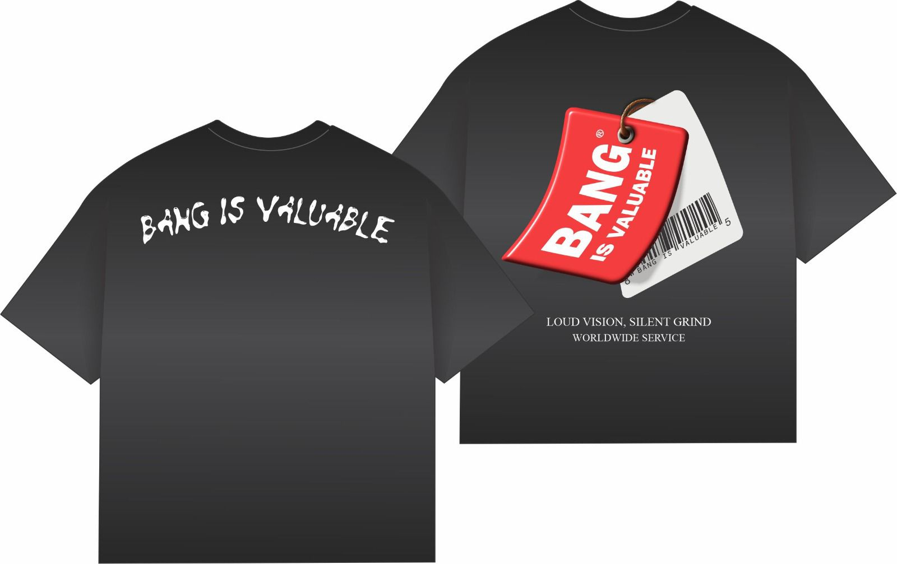

# Bang Fashion — Bang Is Valuable

A fully responsive e-commerce website for **Bang Fashion**, a premium streetwear brand from eMalahleni, South Africa.

## 🔗 Live Demo
> Coming soon via GitHub Pages

## ✨ Features
- Product catalogue with category filtering (New Arrivals, T-Shirts, Hoodies, Sets, Dresses)
- Product modals with image galleries and size selection
- Shopping cart with quantity tracking
- WhatsApp checkout integration
- Paystack payment link
- Size guide modal with measurements for all categories
- Light / Dark theme toggle
- Fully responsive — mobile, tablet and desktop
- Scroll animations and loading screen

## 🛠️ Built With
- HTML5
- CSS3 (custom properties, flexbox, grid)
- Vanilla JavaScript (no frameworks)
- Cloudinary (image hosting)

## 📁 Project Structure
bang-fashion/
├── frontend/
│   ├── index.html
│   ├── images/
│   └── js/
├── .gitignore
└── README.md
## 🚀 Getting Started
Just open ` https://k-a-v-e-l-o.github.io/bang-fashion/` in your browser — no build step needed.

## 📱 Contact
- Instagram: [@bangentertainment](https://www.instagram.com/bangentertainment/)
- WhatsApp: 068 098 0200
- Location: eMalahleni, South Africa 🇿🇦
